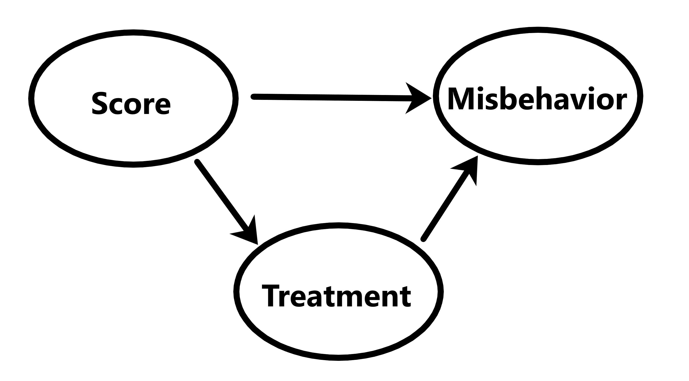

```{r setup, include=FALSE}

# Set output options
knitr::opts_chunk$set(echo = FALSE)
options(knitr.kable.NA = '-')

# Include libraries
library(dplyr)
library(readr)
library(ggplot2)
library(sandwich)
library(uwIntroStats)

# Helper functions
source("functions/inference_table.R")

# Prepare data
prison <- read_csv("data/prison_data.csv") %>% select(response, score, treat)

race_labels <- c("Other", "White", "Black", "Asian", "Hispanic")

birth <- read_csv("data/birthdata.csv") %>%
  filter(smoker == "N", drinker == "N", parity == 0) %>%
  mutate(
    low_bwt = if_else(bwt < 2500, 1, 0),
    sex = if_else(gender == "F", 1, 0),
    f_sex = factor(gender, levels = c("M", "F"), labels = c("Male", "Female")),
    race = factor(race, levels = tolower(race_labels), labels = race_labels)
  ) %>%
  select(low_bwt, age, race, education, sex)

```

# _(Q1)_

```{r fig.cap="Casual diagram relating score, treatment, and behavior", out.width="50%", fig.align="center"}

```

# _(Q2)_

$$
\text{logit}(P(response = 1 \mid score)) = \beta_0 + \beta_1 \cdot score
$$

```{r}
resp_score_lrm <- regress("odds", response ~ score, data = prison)

resp_score_lrm2 <- glm(response ~ score, data = prison, family = "binomial")
resp_score_rse <- sqrt(diag(vcovHC(resp_score_lrm2, type = "HC1")))
```

```{r}
resp_score_inf <- resp_score_lrm %>%
  inference_table(include_intercept = TRUE) %>%
  mutate(`Pr(>|z|)` = format(`Pr(>|z|)`, digits = 3))

q2 <- list(
  as.numeric(resp_score_inf[2, 4:6]) %>% round(digits = 3),
  resp_score_inf[[2, 7]]
)

knitr::kable(
  resp_score_inf, booktabs = TRUE, digits = 3,
  caption = "Inferential statistics for the logistic regression of behavior response on score"
)
```

The coefficient of the score term (slope) is the log-odds ratio of the
associative relationship between score and misbehavior. On average, between two
groups with a one-unit difference in assigned score, the odds ($e^{\beta_1}$) of
a misbehavior event are `r q2[[1]][1]` (95% CI: `r q2[[1]][2]`, `r q2[[1]][3]`)
times higher in the higher-scored group. A _P_-value of `r q2[[2]]` suggests we
can reject the null hypothesis that there is no association between odds of
misbehavior and assigned score in favor of there being some statistically
significant difference.

# _(Q3)_

```{r}
resp_score_pred <-
  tibble(score = c(25, 50, 75)) %>%
  mutate(
    `prob. misconduct` = predict(resp_score_lrm2, newdata = ., type = "response")
  )

knitr::kable(
  resp_score_pred, booktabs = TRUE, digits = 3,
  caption = "Predicted probability of misconduct based on score"
)
```


# _(Q4)_

Yes, since treatment is known to affect behavior


# _(Q5)_

$$
\text{logit}(P(response = 1 \mid score, treat)) =
\beta_0 + \beta_1 \cdot score + \beta_2 \cdot treat
$$

```{r}
resp_score_treat_lrm <- regress("odds", response ~ score + treat, data = prison)

resp_score_treat_lrm2 <- glm(response ~ score * treat, data = prison, family = "binomial")
resp_score_treat_rse <- sqrt(diag(vcovHC(resp_score_treat_lrm2, type = "HC1")))
```

## _(Q5.a)_

```{r}
resp_score_treat_inf <- resp_score_treat_lrm %>%
  inference_table(include_intercept = TRUE) %>%
  mutate(`Pr(>|z|)` = format(`Pr(>|z|)`, digits = 3))

q5a <- list(
  as.numeric(resp_score_treat_inf[2, 4:6]) %>% round(digits = 3),
  as.numeric(resp_score_treat_inf[3, 4:6]) %>% round(digits = 3),
  tibble::deframe(resp_score_treat_inf[2:3, 7])
)

knitr::kable(
  resp_score_treat_inf, booktabs = TRUE, digits = 3,
  caption = paste("Inferential statistics for the logistic regression of",
                  "behavior response on score, adjusted for treatment")
)
```

For two groups of the population with the same treatment status, a one-unit
difference in assigned score is associated with a `r q5a[[1]][1]` (95% CI:
`r q5a[[1]][2]`, `r q5a[[1]][3]`) times change in the odds of a misbehavior
event ($e^\beta_1$) in the higher-scored group, on average.

For two groups of the population with the same score, being assigned to a
maximum security prison is associated with a `r q5a[[2]][1]` (95% CI:
`r q5a[[2]][2]`, `r q5a[[2]][3]`) times change in odds of a misbehavior event
($e^\beta_2$), on average.

In both cases, the estimated coefficients are significant (_P_-values
`r q5a[[3]][1]` and `r q5a[[3]][2]`, respectively) and not equal to zero, so we
can separately reject the null hypotheses that each included variable is not
significantly associated with misbehavior.


## _(Q5.b)_

```{r}
resp_score_treat_pred <- expand.grid(treat = 0:1, score = c(25, 50, 75)) %>%
  mutate(
    `prob. misconduct` = predict(resp_score_treat_lrm2, newdata = ., type = "response")
  )

knitr::kable(
  resp_score_treat_pred, booktabs = TRUE, digits = 3,
  caption = "Predicted probability of misconduct based on score and treatment"
)
```

# _(Q6)_

_(Optional)_

# _(Q7)_

$$
\text{logit}(P(response = 1 \mid score, treat)) =
\beta_0 + \beta_1 \cdot score + \beta_2 \cdot treat +
\beta_3 (score \cdot treat)
$$

```{r}
resp_score_treat_int_lrm <- regress("odds", response ~ score * treat, data = prison)
```

```{r}
resp_score_treat_int_inf <- resp_score_treat_int_lrm %>%
  inference_table(include_intercept = TRUE) %>%
  mutate(`Pr(>|z|)` = format(`Pr(>|z|)`, digits = 3))

q7 <- list(
  round(resp_score_treat_int_inf[[4, 2]], digits = 3),
  resp_score_treat_int_inf[[4, 7]]
)

knitr::kable(
  resp_score_treat_int_inf, booktabs = TRUE, digits = 3,
  caption = paste("Inferential statistics for the logistic regression of",
                  "behavior response on score, adjusted for treatment",
                  "(including interaction term)")
)
```

From the above logistic regression, we estimate that for two groups of the
population both assigned to maximum security, a one-unit increase in assigned
score modifies the association of the log-odds ratio of misbehavior by
`r q7[[1]]`. A _P_-value of `r q7[[2]]` suggests we reject the null hypothesis
that there is no association between the interaction of assigned score and
treatment.

# _(Q8)_

## _(Q8.a,b)_

```{r}

# resp_score_treat_int_inf

```


 - Odds ratio characterizing the association between classification score and
   misconduct for prisoners **not** assigned to maximum security:

 - Odds ratio characterizing the association between classification score and
   misconduct for prisoners assigned to maximum security:

## _(Q8.c)_

# _(Q9)_

## _(Q9.a,b)_

For the question of interest, **mother's education** plays the role of a
_confounder_, while **baby's sex** plays is a _precision_ variable.

## _(Q9.c)_

```{r}
birth_lrm <- regress(
  "odds",
  low_bwt ~ age + factor(race) + education + sex,
  data = birth
)
```

```{r}
birth_inf <- birth_lrm %>%
  inference_table(include_intercept = TRUE) %>%
  mutate(`Pr(>|z|)` = format(`Pr(>|z|)`, digits = 3))

knitr::kable(
  birth_inf, booktabs = TRUE, digits = 3,
  caption = paste("Inferential statistics for the logistic regression of",
                  "low birth weight by age, adjusted for race, education, and sex")
)
```

From our logistic regression model fit with robust standard error estimates,
we estimate that for two subgroups of the population with the same race,
education level, and baby's sex, a one year difference in age between the
groups is associated with a $1.022$ (95% CI: $0.974$, $1.073$) times change in
the odds of low birthweight. From the table above, we see this estimate is not
statistically significant enough to reject the hypothesis that there is no
association between lowe birthweight and age. The only covariate that was
statistically significant was education, which decreased the odds of having
a low birthweight child between groups (Odds $0.892$, 95% CI: $0.809$, $0.983$).
